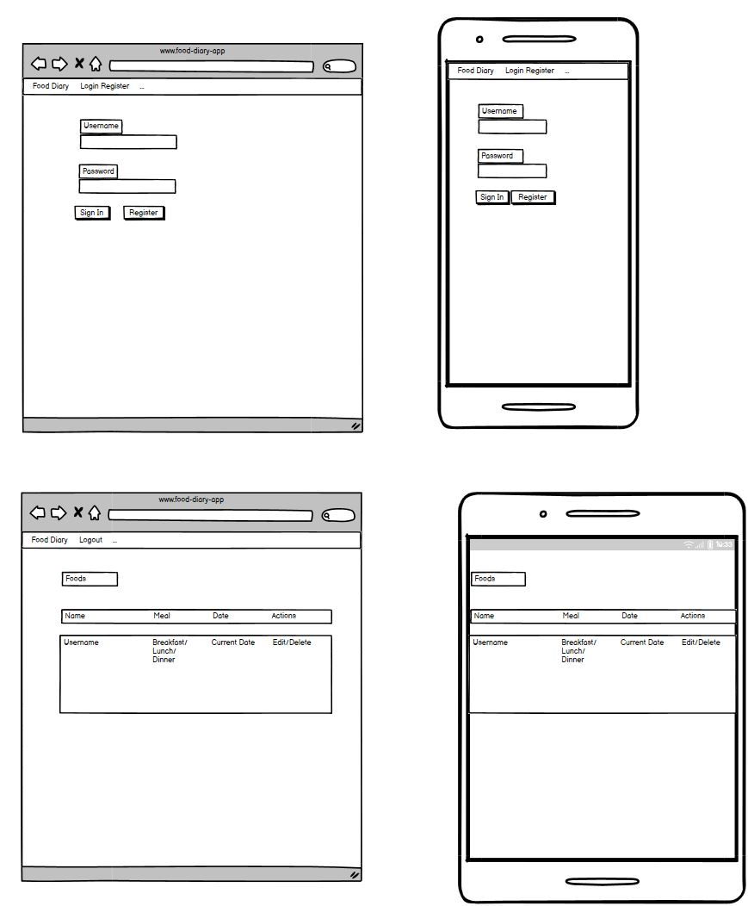

# Food Diary

## Overview

Food Diary is a lightweight Django application for tracking meals and food entries. It provides a simple, user-focused interface where each authenticated user can create, view, update, and delete their own food records. The project emphasizes accessibility and consistent visual design using Bootstrap plus a curated site stylesheet.

## Table of Contents

- Overview
- Getting Started
	- Prerequisites
	- Local Setup & Migrations
- UX Design
- Key Features
- Future Enhancements
- Contributing

## UX Design

- Clean, readable layout focused on content and forms.
- Consistent visual language: Bootstrap + `static/css/style.css`.
- Centered auth cards (`.auth-card`) for login/register/logout pages.
- Sticky footer and a centered main container (≈980px max-width).
- Accessible: visible focus states, a "skip to main content" link, and keyboard-friendly controls.
- Forms: clear labels, inline validation errors, and accessible controls.
- Feedback: flash messages appear at the top and auto-dismiss after 5 seconds.
- Responsive: auth card and main container adapt on small screens; actions stack on narrow viewports.

## Project Planning
MOSCOW Prioritisation
- Create User Accounts (Must-Have)
- Update User Data from Admin Panel (Must-Have)
- User Login (Should-Have)
- Add Food Items To Diary (Should-Have)
- Edit or Delete Diary Logs (Should-Have)
- Filter and Search List (Wont-have, Future Enhancement)
- Log Calories To Food Diary (Wont-have, Future Enhancement)

Wireframes

## Key Features

- Per-user food tracking: each `Food` record belongs to a user; list views show only the current user's entries.
- Full CRUD: create, read, update, delete food entries with server-side ownership checks.
- Authentication: django-allauth is wired for sign up, login, logout, and account management.
- Accessible UI: clear focus states, skip link, and readable forms.
- Flash messages: actions (create/update/delete) show success messages; messages auto-dismiss after 5 seconds.
- Admin integration: `Food` model registered in Django admin for quick inspection and management.

## Developer Notes

This section lists the most important code locations and a short description to help future development.

- Models
	- `food_diary/models.py` — `Food` model
		- `name` (CharField): the food item name
		- `date` (DateField, `auto_now_add=True`): set automatically when the record is created
		- `meal_type` (CharField): choice field (breakfast, lunch, dinner, snack)
		- `user` (ForeignKey to `AUTH_USER_MODEL`): owner of the record

- Forms
	- `food_diary/forms.py` — `FoodForm` (ModelForm)
		- Exposes `name` and `meal_type` (the `date` is auto-populated by the model)
		- Widgets configured for consistent `.form-control` / `.form-select` styling

- Views
	- `food_diary/views.py`
		- `food_diary_view`: home/login landing; redirects authenticated users to the food list
		- `food_list`: shows current user's foods (`Food.objects.filter(user=request.user)`)
		- `food_create`: creates a `Food` instance and attaches `request.user`; shows a success message
		- `food_update`: edits a `Food` instance; raises `Http404` if the current user is not the owner
		- `food_delete`: asks for confirmation and deletes the instance on POST; raises `Http404` for unauthorized access

- Templates
	- `templates/base.html` — site base, navbar, message rendering, and alert auto-dismiss script
	- `food_diary/templates/food_diary.html` — login/landing page (uses allauth login view)
	- `food_diary/templates/food_list.html` — user's food list with actions to edit/delete
	- `food_diary/templates/food_form.html` — create/edit form (does not show `date` field)
	- `food_diary/templates/food_delete_confirm.html` / `food_diary/templates/food_delete_confirm.html` — delete confirmation (a clean template is used)
	- `templates/account/signup.html` — customized signup page that extends the project `base.html` and uses the `.auth-card` pattern

- Admin
	- `food_diary/admin.py` — registers the `Food` model for the Django admin

Notes
- Flash messages use Django's `messages` framework and are rendered in `base.html`; they auto-dismiss via a small JS snippet.
- Ownership checks are performed server-side in views to prevent unauthorized edits/deletes.
- The project uses `django-allauth` for authentication; account templates are under `templates/account/` and the signup template has been adapted to match the site's styling.

## Future Enhancements

- Add calorie tracking feature
- Add overall calorie feature for one given day cycle
- Add filtering and search on the food list (by date range, meal type, keyword).
- Create weight section for a user
- Using this weight section, set current weight and goal weight
- Add exercise section, logging exercises done on a particular day with an approximate of calories burned
- Optional social authentication via allauth.socialaccount.